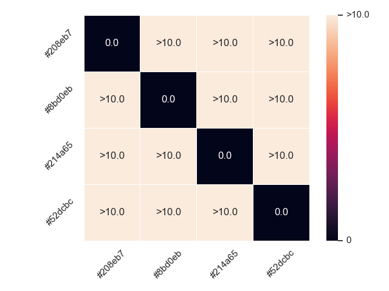
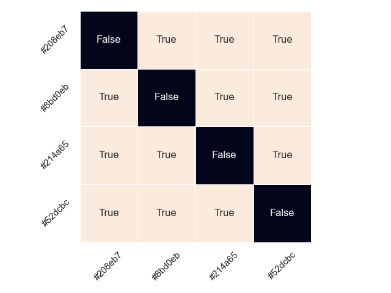
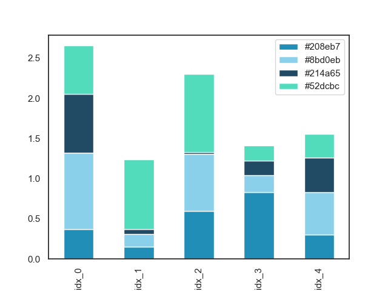
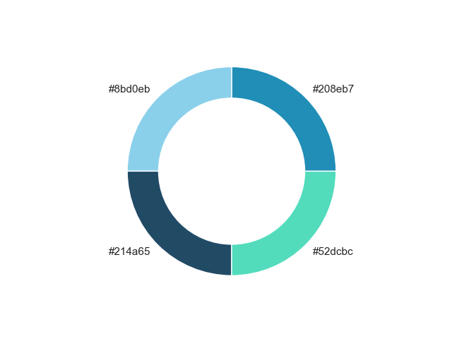
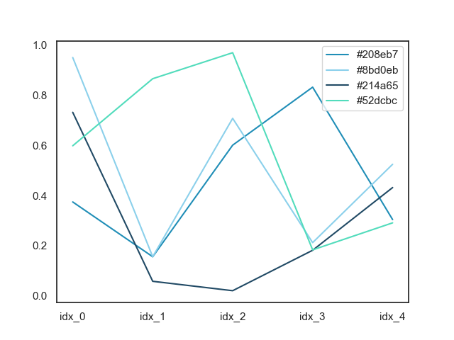
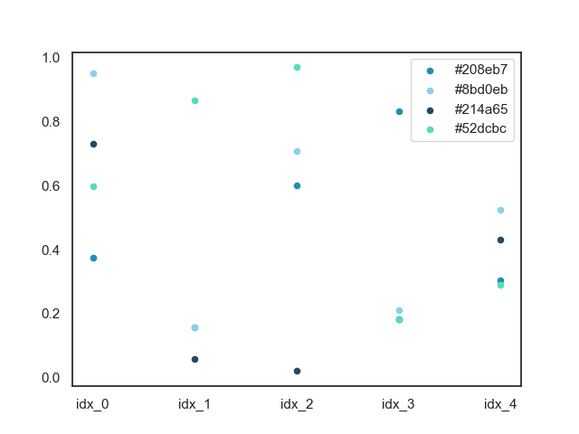

## Reading Results


### Metrics

The metrics are returned as list of dictionaries. For example, if we use `methods=[benchmark.LightnessBenchmark]` as the `metrics` argument, we get a length one list for `["#208eb7", "#8bd0eb", "#214a65", "#52dcbc"]`,

```python
[
    {
        'method': 'lightness',
        'data': {
            'lightness': [84.91983092093982, 29.92196529863262, 84.89371481804541, 49.84008327873316, 74.84871458198634, 59.995102078239626],
            'min_lightness': 25,
            'max_lightness': 85,
            'smaller_than_max': [True, True, True, True, True, True],
            'greater_than_min': [True, True, True, True, True, True],
            'bounded_by_min_max': [True, True, True, True, True, True]
        }
    }
]
```

If multiple benchmarks are provided, i.e., `methods=[benchmark.PerceptualDistanceBenchmark, benchmark.LightnessBenchmark]`, we get multiple metrics returned as a list.


```python
[
    {
        'method': 'perceptual_distance',
        'data': {
            'colors': ['#8de4d3', '#344b46', '#74ee65', '#238910', '#a6c363', '#509d99'],
            'lab': [(84.91983092093982, -30.077937807876264, 0.02004498485879136), (29.92196529863262, -10.125651525571849, 0.11432219452202075), (84.89371481804541, -59.80516907528527, 55.02104980247336), (49.84008327873316, -49.880004054854155, 49.88542716044376), (74.84871458198634, -24.89418244566888, 44.67650807158665), (59.995102078239626, -24.750918732142523, -5.256244862912585)],
            'distances': [[0.0, 51.595487359709644, 22.65815239947601, 35.416816157500605, 23.89289149811552, 19.300512151508368], [51.595487359709644, 0.0, 56.39906000723282, 29.903204552554257, 49.4276053685809, 30.206424477640848], [22.658152399476016, 56.39906000723282, 0.0, 28.124661697115705, 13.768615584198283, 32.78257261407205], [35.41681615750062, 29.903204552554257, 28.124661697115705, 0.0, 23.282610044487893, 27.59833645833781], [23.89289149811552, 49.4276053685809, 13.768615584198294, 23.282610044487903, 0.0, 28.627463185209976], [19.300512151508364, 30.206424477640848, 32.78257261407205, 27.5983364583378, 28.62746318520996, 0.0]],
            'noticable': [[False, True, True, True, True, True], [True, False, True, True, True, True], [True, True, False, True, True, True], [True, True, True, False, True, True], [True, True, True, True, False, True], [True, True, True, True, True, False]]
        }
    },
    {
        'method': 'lightness',
        'data': {
            'lightness': [84.91983092093982, 29.92196529863262, 84.89371481804541, 49.84008327873316, 74.84871458198634, 59.995102078239626],
            'min_lightness': 25,
            'max_lightness': 85,
            'smaller_than_max': [True, True, True, True, True, True],
            'greater_than_min': [True, True, True, True, True, True],
            'bounded_by_min_max': [True, True, True, True, True, True]
        }
    }
]
```

### Visualizations

#### Perceptual Distance

The following results are the results for `["#208eb7", "#8bd0eb", "#214a65", "#52dcbc"]`.

=== "Distance matrix"

    The deltaE distance matrix is plotted as a heatmap. In general, the larger the distance, the easier for us to distinguish.

    *We ceil all the distance values to 10 in this chart as large distances in L*a*b space desn't have an intuitive meaning.*

    

=== "Noticable Distance Matrix"

    If two colors are two close to each in a perceptual uniform color space, it is hard to distinguish them.

    This heatmap shows whether any pair of colors are distinguishable.

    


#### Lightness


!!! warning "WIP"
    Not yet visualized.

#### Emperical

We will automatically create several charts using the color palette.

The following charts are the results for `["#208eb7", "#8bd0eb", "#214a65", "#52dcbc"]`.

=== "Bar chart"

    

=== "Donut chart"

    

=== "Line chart"

    

=== "Scatter plot"

    
